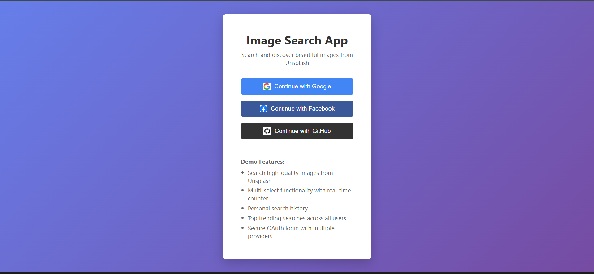
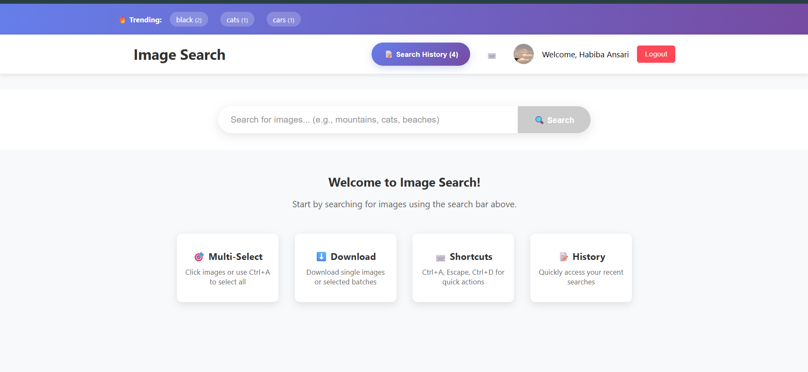
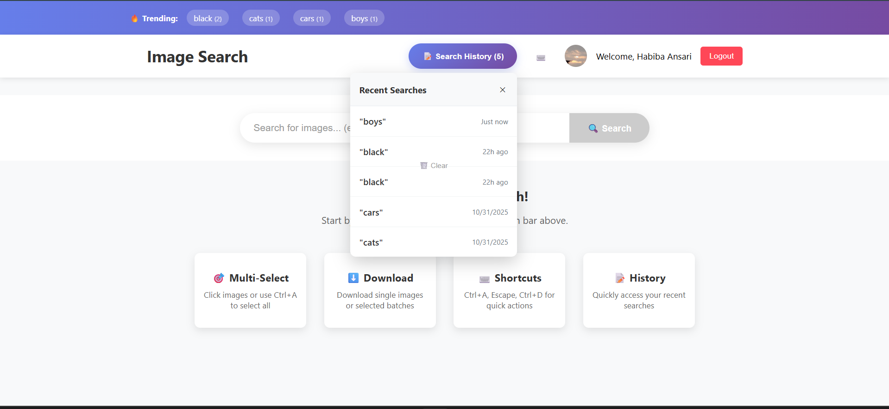
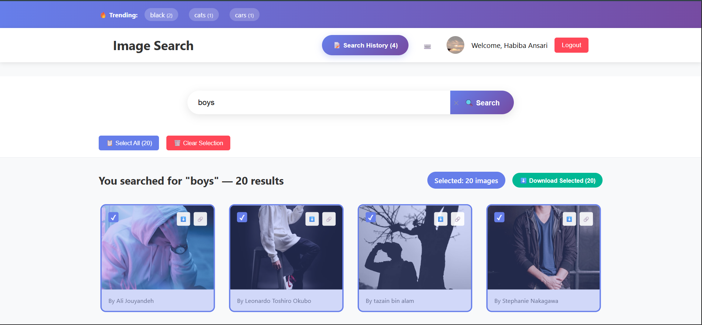

# 🖼️ Image Search App - MERN Stack + OAuth

A full-stack image search application built with the MERN stack (MongoDB, Express.js, React.js, Node.js) featuring OAuth authentication, Unsplash API integration, and real-time search functionality.

## 🚀 Features

- **🔐 OAuth Authentication** - Login with Google, Facebook, and GitHub
- **🖼️ Image Search** - Search millions of high-quality images from Unsplash API
- **🎯 Multi-Select** - Select multiple images with real-time counter
- **🔥 Top Searches** - Discover trending searches across all users
- **📝 Search History** - Personal search history with quick re-search
- **⬇️ Download Images** - Download single or multiple selected images
- **⌨️ Keyboard Shortcuts** - Ctrl+A (Select All), Escape (Clear), Ctrl+D (Download)
- **📱 Responsive Design** - Works perfectly on desktop, tablet, and mobile
- **⚡ Real-time Updates** - Live selected images counter and search results

## 🛠️ Tech Stack

### Frontend
- React.js
- React Router
- Axios for API calls
- CSS3 with Grid & Flexbox
- Context API for state management

### Backend
- Node.js
- Express.js
- MongoDB with Mongoose
- Passport.js for OAuth
- Express Sessions

### External APIs
- Unsplash API for images
- Google OAuth 2.0
- Facebook OAuth
- GitHub OAuth

## 📁 Project Structure
image-search-app/
├── client/ # React frontend
│ ├── public/
│ ├── src/
│ │ ├── components/ # Reusable components
│ │ ├── pages/ # Page components
│ │ ├── context/ # React context
│ │ ├── hooks/ # Custom hooks
│ │ ├── services/ # API services
│ │ └── App.js
│ └── package.json
├── server/ # Express backend
│ ├── config/ # Passport configuration
│ ├── models/ # MongoDB models
│ ├── routes/ # API routes
│ ├── services/ # External API services
│ └── server.js
└── README.md


## 🚀 Quick Start

### Prerequisites
- Node.js (v14 or higher)
- MongoDB (local or Atlas)
- Git

### Installation

1. **Clone the repository**
   ```bash
   git clone http://github.com/Habiba-Ansari/image-search-app/
   cd image-search-app

### Backend (.env)
MONGODB_URI=mongodb://localhost:27017/image-search
PORT=5000
GOOGLE_CLIENT_ID=261824756529-v05504sk3aiig44mm00t4vruc5torf88.apps.googleusercontent.com
GOOGLE_CLIENT_SECRET=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
SESSION_SECRET=Image_search_Assissment
UNSPLASH_ACCESS_KEY=guMKQj8AqgYruIb-FeJDPD_lYFhJKXvgf3vW4t6VpEc
FACEBOOK_APP_ID=your_facebook_app_id_here
FACEBOOK_APP_SECRET=your_facebook_app_secret_here
GITHUB_CLIENT_ID=Ov23liERIpj3ayALSlhX
GITHUB_CLIENT_SECRET=bd2d0b5a31c3a0ecb55e950712b2acfcce969f4a

### Run the App
# Backend
cd server
npm install
npm run dev

# Frontend (new terminal)
cd client  
npm install
npm start

## 📸 Screenshots



 




## API Testing

### Example cURL commands:
# 1. Get top searches (public - no auth needed)
curl http://localhost:5000/api/search/top-searches

# 2. Search images (requires login - use after OAuth)
curl -X POST http://localhost:5000/api/search \
  -H "Content-Type: application/json" \
  -d '{"term": "mountains"}'

# 3. Get user search history (requires login)
curl http://localhost:5000/api/search/history
